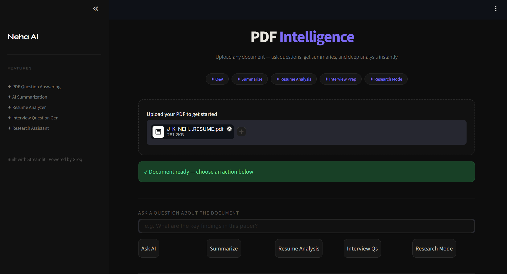
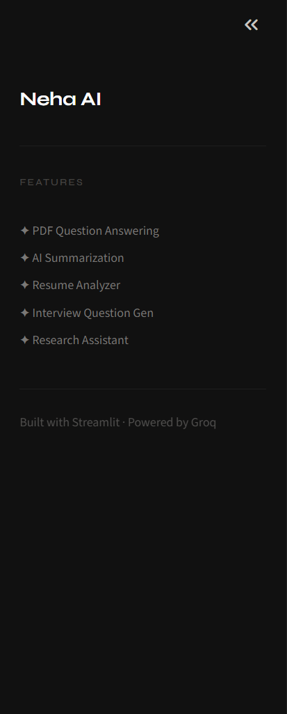
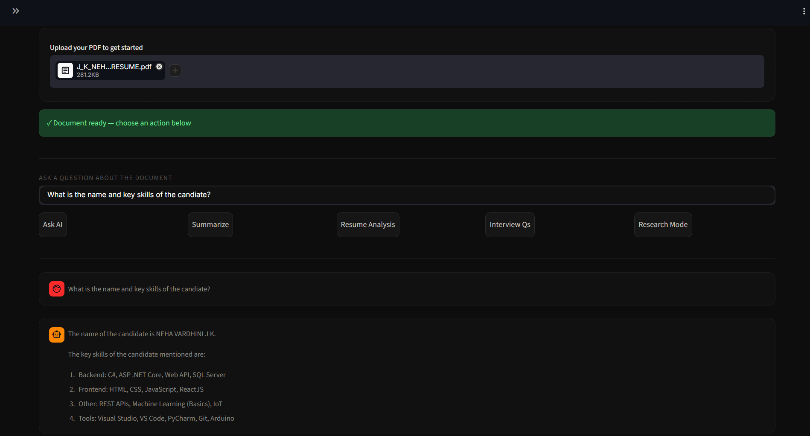
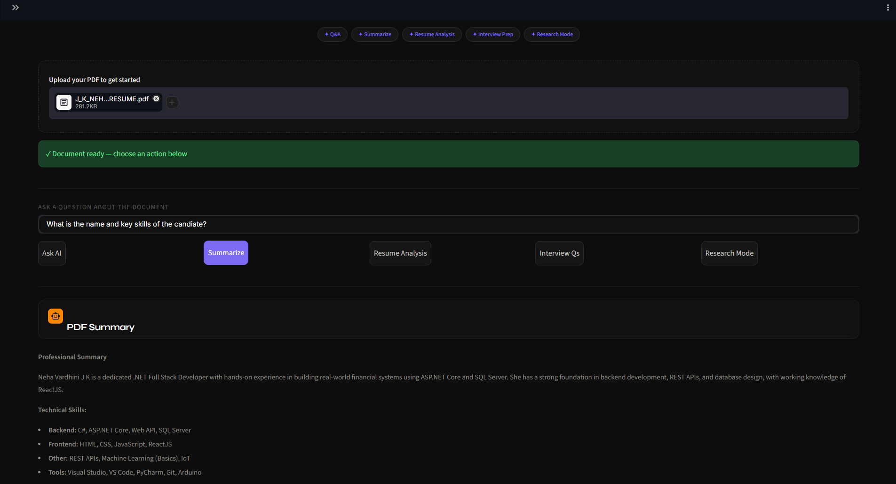
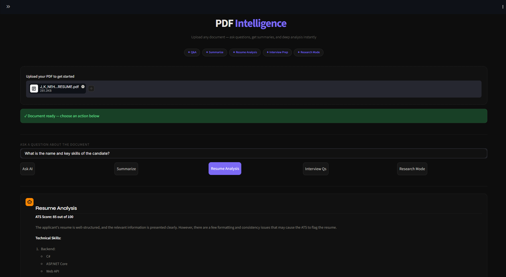
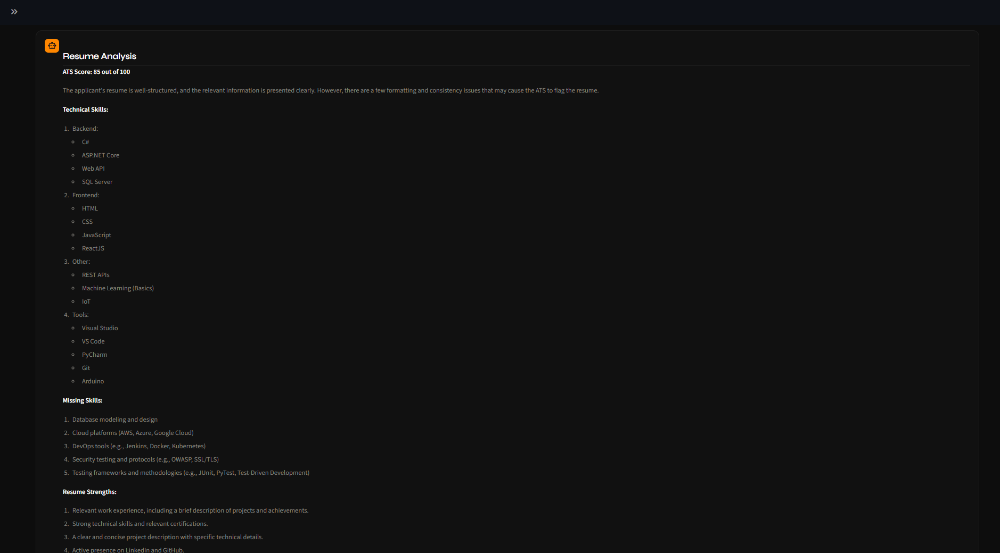
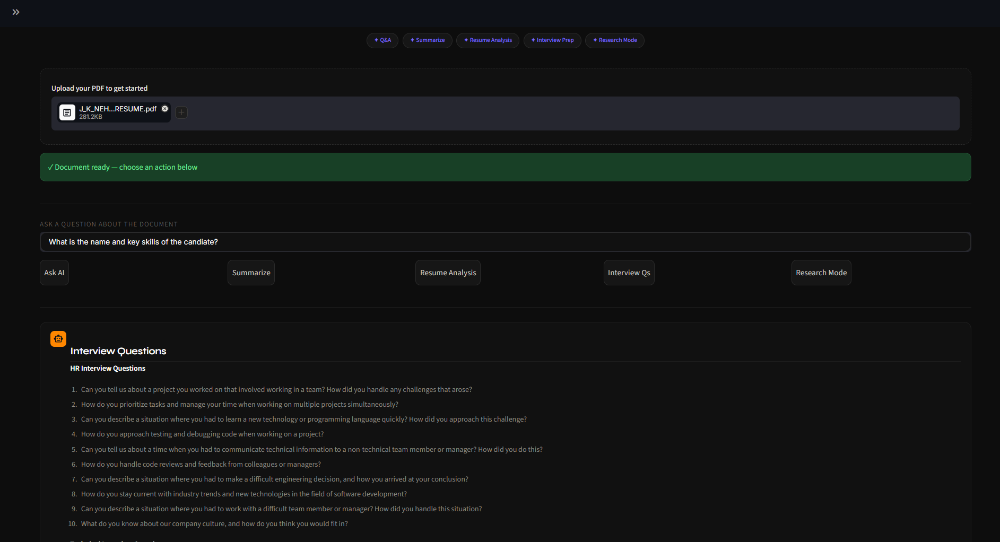
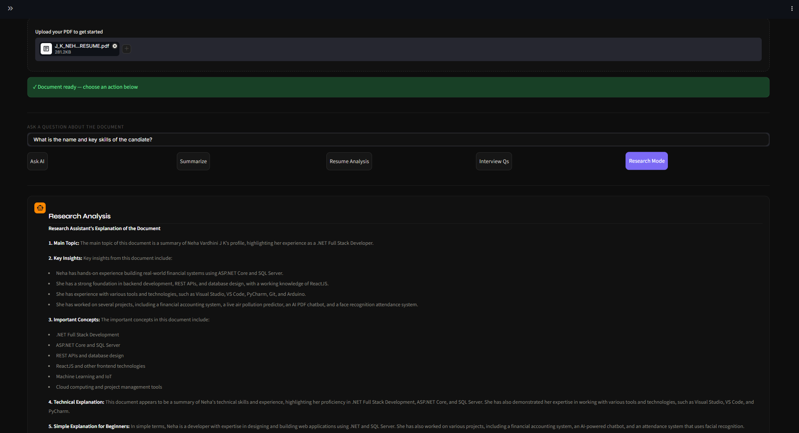

<div align="center">

[](https://git.io/typing-svg)
 


<br/>

<br>


> **An AI-powered PDF assistant** that lets you upload any document and instantly ask questions, generate summaries, analyze resumes, create interview questions, and run deep research analysis — all in a sleek dark-themed UI.

**[🚀 Live Demo](https://pdf-ai-assistance-bot-live.onrender.com/)** · **[📸 Screenshots](results/)** · **[⚙️ Setup](#-setup--usage)**

</div>

---

## 📑 Table of Contents

- [Overview](#-overview)
- [Features](#-features)
- [Tech Stack](#-tech-stack)
- [Project Structure](#-project-structure)
- [How It Works](#-how-it-works)
- [App Modes](#-app-modes)
- [Results Gallery](#-results-gallery)
- [Setup & Usage](#-setup--usage)
- [Deployment](#-deployment)
- [Security](#-security)
- [Future Work](#-future-work)
- [Author](#-author)

---

## 🎯 Problem Statement

Reading lengthy PDFs such as research papers, resumes, reports, and technical documentation can be time-consuming. Traditional PDF readers allow users to search text but cannot understand or explain document content.

This project solves that problem by enabling users to interact with PDF documents using natural language through a Large Language Model (LLM).

---

## 🌍 Overview

**AI PDF Intelligence Bot** is a full-featured document analysis tool that combines PDF parsing with the speed of the **Groq inference API** and the intelligence of **LLaMA 3.1** to deliver instant, accurate answers from any uploaded document.
The modern dark-themed interface was designed with assistance from Claude AI, while the application logic and implementation were developed in Python using Streamlit.
Whether you're a student researching a paper, a job seeker analyzing your resume, or a professional summarizing a report — this tool turns static PDFs into interactive, queryable knowledge.

---

## ✨ Features

| Feature | Description |
|:---|:---|
| 💬 **Q&A Mode** | Ask any question — the AI answers strictly from the uploaded PDF |
| 📝 **Summarization** | Instantly generate a clean, professional summary of any document |
| 🧑‍💼 **Resume Analyzer** | ATS score, skill gaps, strengths, weaknesses, and job role suggestions |
| 🎯 **Interview Question Generator** | HR, Technical, Project, Coding, and Behavioral questions from your resume |
| 🔬 **Research Mode** | Deep-dive analysis with key insights, concepts, and real-world applications |
| 🎨 **Dark UI** | Minimal, elegant interface with Syne + Inter typography |
| ⚡ **Groq-Powered Speed** | Ultra-fast inference via Groq's LPU hardware |

---

## 🛠️ Tech Stack

| Category | Tools / Libraries |
|:---|:---|
| Language | Python 3.10 |
| UI Design | Claude AI (UI/UX assistance) |
| Frontend | Streamlit + Custom CSS |
| AI / LLM | Groq API · LLaMA 3.1 8B Instant |
| PDF Processing | PyPDF2 |
| Styling | Custom CSS · Google Fonts (Syne, Inter) |
| Deployment | Render |
| Environment | python-dotenv |

--- 

## 🤖 AI Technologies

- Generative AI
- Large Language Models (LLMs)
- Natural Language Processing (NLP)
- Prompt Engineering
- AI-powered Document Intelligence

---

## 📁 Project Structure

```
pdf-ai-assistance-bot-live/
│
├── app.py                    # Main Streamlit application
├── requirements.txt          # Python dependencies
├── .env.example              # Template for API credentials
│
└── results/                  # Output screenshots & demo
    ├── working_pdf_ai_bot.mp4
    ├── uploding_pdf_doc.png
    ├── sidepane_nav.png
    ├── pdf_ask_ai.png
    ├── pdf_summarization.png
    ├── pdf_Resume_analysis.png
    ├── pdf_resume_ana;ysis_1.png
    ├── pdf_interview_qs.png
    └── pdf_Research_mode.png
```

---

## 𓂃✍︎ Architecture

                User
                  │
                  ▼
          Streamlit Interface
                  │
                  ▼
             Upload PDF
                  │
                  ▼
        PyPDF2 Text Extraction
                  │
                  ▼
         Prompt Engineering
                  │
                  ▼
              Groq API
                  │
                  ▼
       Llama 3.1 8B Instant
                  │
                  ▼
          AI Generated Response
                  │
                  ▼
            Streamlit Output

 ---

## ⚙️ How It Works

```
STEP 1 — UPLOAD
  User uploads a PDF document via the Streamlit file uploader.

STEP 2 — EXTRACT
  PyPDF2 parses and extracts all text content from the PDF pages,
  handling encrypted files gracefully.

STEP 3 — SELECT MODE
  User picks from 5 modes: Ask AI, Summarize, Resume Analysis,
  Interview Questions, or Research Mode.

STEP 4 — PROMPT
  The extracted PDF text is injected into a carefully crafted
  prompt tailored to the selected mode.

STEP 5 — INFER
  The prompt is sent to Groq's API running LLaMA 3.1 8B Instant —
  leveraging Groq's high-speed LPU inference for low-latency responses.

STEP 6 — RESPOND
  The AI response is rendered in a clean chat-style interface
  directly in the Streamlit app.
```

---

## 📝 Applications

• Resume Screening

• Research Paper Analysis

• Technical Documentation

• Student Learning

• Interview Preparation

• Business Reports

• Legal Documents

• Academic Projects

---

## 🧩 App Modes

### 💬 Ask AI
The model is instructed through prompt engineering to answer based on the uploaded PDF content, improving response relevance and reducing unsupported answers

### 📝 Summarize
Generates a clear, professional summary of the entire document — ideal for quickly understanding long reports, papers, or contracts.

### 🧑‍💼 Resume Analyzer
Performs a full resume audit:
1. ATS Score (out of 100)
2. Technical Skills Found
3. Missing Skills
4. Resume Strengths & Weaknesses
5. Improvement Suggestions
6. Best Suited Job Roles

### 🎯 Interview Question Generator
Creates a complete interview prep kit:
1. HR Interview Questions
2. Technical Interview Questions
3. Project-Based Questions
4. Coding Questions
5. Behavioral Questions

### 🔬 Research Mode
Deep document analysis covering:
1. Main Topic
2. Key Insights
3. Important Concepts
4. Technical Explanation
5. Beginner-Friendly Explanation
6. Real-World Applications
7. Final Conclusion

---

## 🖼️ Results Gallery

### Uploading a PDF Document


### Sidebar Navigation


### Ask AI Mode


### Summarization


### Resume Analysis




### Interview Question Generator


### Research Mode


---

## 🚀 Setup & Usage

### 1. Clone the repository
```bash
git clone https://github.com/jk-neha/pdf-ai-assistance-bot-live.git
cd pdf-ai-assistance-bot-live
```

### 2. Install dependencies
```bash
pip install -r requirements.txt
```

### 3. Configure credentials
```bash
cp .env.example .env
# Open .env and add your Groq API key:
# GROQ_API_KEY=your_groq_api_key_here
```

> Get your free Groq API key at [console.groq.com](https://console.groq.com)

### 4. Run the app
```bash
streamlit run app.py
```

Open your browser at `http://localhost:8501` and start uploading PDFs.

---

## ☁️ Deployment

This project is live-deployed on **Render** as a web service.

| Platform | URL |
|:---|:---|
| 🟢 Live App | [pdf-ai-assistance-bot-live.onrender.com](https://pdf-ai-assistance-bot-live.onrender.com/) |
| 📦 Repository | [github.com/jk-neha/pdf-ai-assistance-bot-live](https://github.com/jk-neha/pdf-ai-assistance-bot-live) |

To deploy your own instance on Render:
1. Fork this repository
2. Create a new **Web Service** on Render
3. Set `GROQ_API_KEY` in the environment variables
4. Set the start command to `streamlit run app.py --server.port $PORT --server.address 0.0.0.0`

---

## 🔐 Security

All API credentials are managed via a `.env` file and are **never committed to the repository**.

A `.env.example` template is provided with placeholder values. **Never share or commit your actual `.env` file.**

---

## 🔮 Future Work

- [ ] Multi-PDF upload and cross-document Q&A
- [ ] Conversation memory for multi-turn chat
- [ ] Export analysis results as PDF or Word report
- [ ] Support for scanned PDFs via OCR
- [ ] User authentication and saved session history
- [ ] Upgrade to LLaMA 3.3 / larger context models
- [ ] Dark/light theme toggle

---

## 👩‍💻 Author

**Neha Vardhini J K** · [@jk-neha](https://github.com/jk-neha)

> *Personal Project — AI-Powered PDF Intelligence Bot using Groq + Streamlit*

---

<div align="center">

*⭐ If this project helped you, consider giving it a star — it helps others discover it.*

</div>
